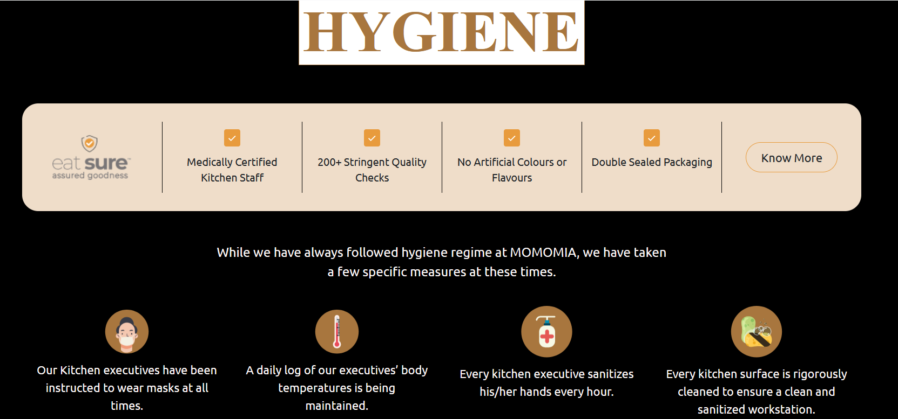

# MOMOMIA

The purpose of an Online Food Ordering System is to automate the existing manual system with the help of computerized equipment and full-fledged computer software, fulfilling their requirements so that their valuable data/information can be stored for a longer period with easy access and manipulation of the same. The required software and hardware are easily available and easy to work with.

The aim is to automate its existing manual system with the help of computerized equipment and full-fledged computer software, fulfilling their requirements, so that their valuable data/information can be stored for a longer period with easy access and manipulation of the same. Basically, the project describes how to manage for good performance and better services for the clients.

## Website Link-
<a href="https://momomia-emux.onrender.com">MOMOMIA</a>

# SCREENSHOTS 

**Thank you for your interest**

**Best of luck 👍**
